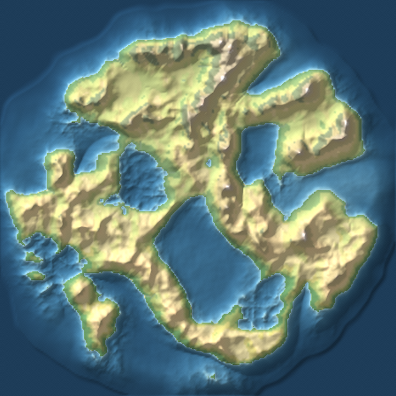

# Silt

A procedural atlas generator. Give it a word; it gives you a world and the map of it.

*Archived from `C:\dev\5` — built by Claude Opus 5 in an earlier session, blind.
The exact prompt and date are the carrier's to attest: a C cannot self-date.*



*`python -m silt elmwood` regenerates this plate exactly — same continent, any
machine, any day. The preview is the only output committed; everything else is
one command away, which is the whole point.*

```bash
python -m silt kestrel
```

```
out/nertagne-kestrel.svg     the plate
out/nertagne-kestrel.md      the gazetteer
out/nertagne-kestrel.json    every measurement
```

Pure Python 3.9+ (developed and tested on 3.12). No dependencies — not numpy,
not Pillow, nothing. The PNG
encoder, the noise, the random number generator and the map projection are all
in here, because the interesting part of this project *is* those things.

Every world is a pure function of its seed. `silt kestrel` produces the same
continent today and next year, on Windows and on Linux, and `--size` changes
only how finely that continent is resolved — not which continent it is.

---

## What it actually does

Nothing on the map is drawn. Each stage reads only what the stages before it
produced, and the features come out as consequences.

**1. Rock.** Fractal noise raises a landmass. Mountain belts are placed along
the *zero-contour of a smooth noise field*, widened into ribbons — which is the
trick that makes ranges run in lines, with a near side and a far side, instead
of scattering in clumps the way ridged noise alone does. Then the elevation
histogram is bent towards a planet's: most land near sea level, high ground a
thin tail. Fractal noise is symmetric and real continents are not.

**2. Water.** Priority-flood fills every closed basin to its outlet, plus a
hair. That hair makes "downhill" a strict order, which makes the drainage graph
a forest, which lets everything downstream be three linear passes: D8 flow
directions, upstream area, Strahler stream order.

**3. Erosion.** The stream-power law, `dz/dt = U − K·Aᵐ·Sⁿ`, run over that
network a couple of dozen times. Erosion is proportional to how much water
passes and how steeply it falls, so big rivers grind their valleys flat while
headwaters stay steep. This is the step that makes terrain look like *somewhere*
rather than like noise: valleys that join at acute angles, sharp interfluves
where catchments meet, slopes that shallow as the river below them grows.

**4. Rain.** Moist air is swept across the map from the prevailing wind and
drops its water wherever the ground rises beneath it. Downwind of a range there
is nothing left to fall, so a desert appears behind the mountains with forest on
the windward slope. Nobody placed the desert. The wind direction follows the
latitude band — easterly trades in the tropics, westerlies in the temperate
belt — so which flank of a range is wet depends on where in the world you are.

**5. Names.** One to three invented languages, each holding the ground nearest
its own seed point. They differ in phoneme inventory, in how often codas occur,
and in whether the word for "river" leads or trails. The effect is that the
north-west is all `-fell` and `-vatn` while the southern coast is `Serra` and
`Rio`, and the reader infers two peoples and a frontier that nobody wrote.

**6. The plate.** Ground as an embedded PNG (hypsometric colour, biome tint,
hillshade); coast, contours, rivers, lakes, graticule and labels as vectors over
it. One self-contained SVG with no external references.

## Rivers you can check

Because rivers fall out of the physics rather than being drawn, they can be
wrong in ways a hand-drawn map cannot, and right in ways it cannot either. The
test suite checks the invariants directly: every land cell drains to the sea,
drainage area is conserved, Strahler numbering obeys its rule, and every drawn
polyline follows actual receiver links.

The erosion has a sharper test. Stream power drives a landscape towards
`S ∝ A^(−m/n)`, so regressing log channel slope against log drainage area should
recover an exponent near −0.5 for the default `m=0.5, n=1`. Averaged over seeds
it lands within a hundredth of that. Raw fractal noise does not, and neither
does an over-eroded landscape. It is the one number that says whether the
parameters are set sensibly, so the tuning is a test rather than an opinion.

## Usage

```bash
python -m silt                          # the default seed
python -m silt kestrel                  # a world named by a word
python -m silt kestrel --size 320       # the same world, resolved finer
python -m silt kestrel --scale 6        # a larger plate
python -m silt --count 6 --out plates   # six worlds
python -m silt tamarind --erosion 40    # let the rivers work longer
python -m silt --help
```

| Option | Meaning |
|---|---|
| `--size N` | grid width in cells (default 224). Cost grows with the square. |
| `--rows N` | grid height, if you want a non-square sheet |
| `--scale N` | output pixels per cell (default 4); the whole plate scales with it |
| `--erosion N` | stream-power steps (default 24). More means deeper valleys. |
| `--rivers F` | drainage density, 0 (few trunk rivers) to 1 (dense) |
| `--contours F` | contour interval as a fraction of relief |
| `--shade F` | hillshade strength; 0 flattens it |
| `--no-labels`, `--no-graticule` | leave the sheet bare |
| `--formats` | any of `svg,png,md,json,html` |
| `--count N` | several worlds, seeds derived from the one given |

At the defaults a world takes about ten seconds and the plate comes out around
1000 pixels square.

As a library:

```python
from silt import generate, render_atlas

world = generate("elmwood", size=256, erosion=30)
print(world.summary()["highest_point_m"])
for river in world.features.rivers:
    print(river.name, round(river.length_km), "km")

render_atlas(world, "out", scale=5, formats=("svg", "html"))
```

## Layout

```
silt/
  rng.py       SplitMix64 and named streams — the determinism guarantee
  noise.py     Perlin gradient noise; fbm, ridged, billow, domain warp
  field.py     a 2D scalar grid as one flat list, plus flood fill
  terrain.py   continent shapes, mountain belts, the hypsometric curve
  hydro.py     priority flood, D8 routing, accumulation, Strahler, channels
  erosion.py   stream power and hillslope creep
  climate.py   latitude, the orographic rain sweep, biomes
  names.py     invented languages and where each one is spoken
  features.py  finding what a map would label, and naming it
  contour.py   marching squares, chaining, Chaikin, Douglas-Peucker
  png.py       a PNG encoder in forty lines
  render.py    the raster, the linework, label placement, plate furniture
  atlas.py     gazetteer, HTML, and writing files
  world.py     the pipeline
  cli.py       the command line
tests/         151 tests, no dependencies, about fifteen seconds
```

```bash
python -m unittest discover -s tests
```

## Notes

The map is a plate of an unnamed planet, not a globe: latitude is real and drives
climate, longitude is nominal, and no projection is applied, so a sheet spanning
more than about forty degrees would distort if it were real. Sea level is chosen
as a quantile of the finished heightfield rather than being a constant, so every
seed yields a usable amount of land.

Place names are invented from phoneme inventories and mean nothing. A short
blocklist re-rolls past the occasional accidental real word, which is a
mitigation and not a guarantee.

The languages are inventions with borrowed *textures* — one leans Norse, one
Romance, one Polynesian in shape only. No real language's vocabulary is used and
none of the generated words carry meaning.
